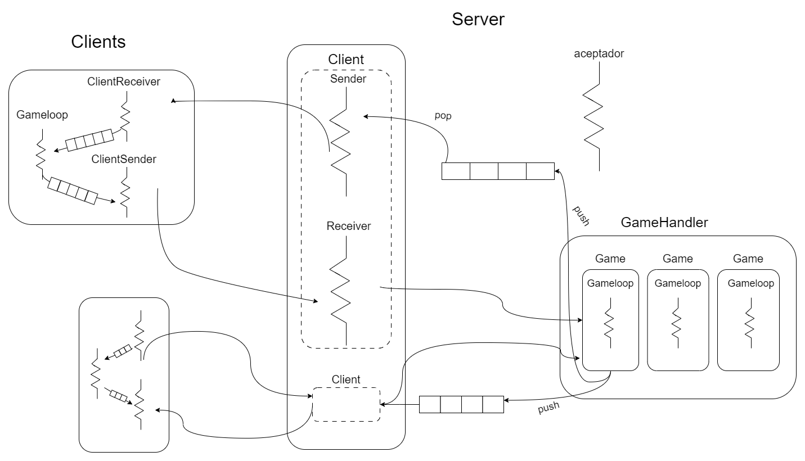
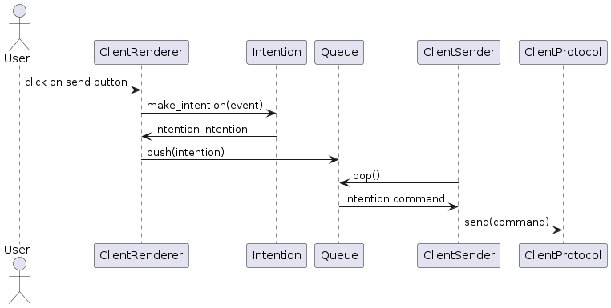
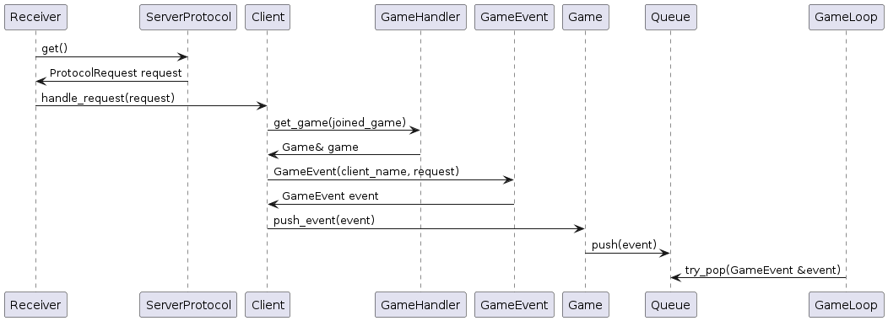

# Manual Técnico

Bienvenidos a **Left4Dead**, El proyecto final de la materia Taller de Programación. A continuación habrá una guía detallada sobre el funcionamiento del juego, orientado a otros desarrolladores, o personas con conocimientos de programación.

## Sobre el juego

Left4Dead está programado en C++. Usa SDL para los modelos, el wrapper Sdl2pp y Qt5 para las ventanas del menú.

## Estructura

Hay 3 carpetas principales:

- **resources**: contiene todos los modelos y archivos de audio
- **qt**: contiene el código de las ventanas del menú
- **common_src**: contiene todo el código del proyecto, tiene sueltos los archivos de uso compartido, se divide en:
- **client**: archivos del cliente
- **network**: archivos de envio y recepcion de archivos, usados en el server
- **server**: archivos del server

El ejecutable client excluye en su compilación los archivos que estén en la carpeta server, de la misma forma que el ejecutable server excluye los que se encuentran el la carpeta client.

## Diseño

### Niveles

Los niveles son sencillos, una caja de 1920x145 por donde los jugadores y los zombies pueden moverse libremente.

### Personajes

Las verdaderas diferencias entre los personajes, son las diferencias entre sus atributos 'arma', la cual contiene a un objeto de tipo **Arma**. Éste encapsula el arma de fuego y la granada en un objeto **GrenadeHolder** . Las armas tienen atributos como los tiempos entre recargas, disparos o tamaño del cargador, pero principalmente se diferencian por los métodos polimórficos 'create_bullet', que pushean a la cola del game distintos objetos **Bullet**. El arma se asigna en el constructor de PlayerState, y la granada, en el constructor de arma.

### Zombies e IA

Nuevamente, los zombies son prácticamente iguales, salvando las diferencias que hay en sus atributos constantes (velocidad, daño, rango de detección, etc. definidos en el game_config), la mayor diferencia que hay entre ellos son los métodos polimórficos **attack** y **calculate_next_movement**.
'attack' define el comportamiento al colisionar con un jugador y calculate_next_movement define el próximo movimiento o acción del zombie, encapsula toda la IA.

## Implementación Técnica

Los sprites, audios y demás son cargados antes del comienzo de la partida mediante el objeto **asset_manager**. Además de las texturas, contiene la cantidad de fotogramas que tiene cada animación, el largo y el ancho.

Las colisiones se manejan con un objeto **Physics manager** que contiene capas (como Jugador, Zombie o Proyectil aliado), Al detectar una colisión entre entidades de capas distintas, llama al método **on_colission_detected** de ambas.

Los inputs, el dibujo de texturas y la reproducción de audio son manejados con Sdl2pp.

## Comunicación

El protocolo es simple, con solo 4 modelos: envío y recibo de números y strings.
La verdadera magia ocurre en el objeto **Serializer** que usa estos 4 métodos para convertir structs complejos de comunicación (definidos en **protocol_types.h**) a tira de bytes (tratados como uint8_t) y viceversa

## Dependencias

- libsdl2-image 2.6.3
- libsdl2-mixer 2.6.3
- libsdl2-ttf 2.20.2
- libsdl2-dev 2.26.5
- libSDL2pp 0.18.1
- qt6-base
- yaml-cpp
- Compilador de C++

## Funcionamiento

### Lobby

Al conectarse un cliente nuevo, antes de que comienza en la partida, el cliente tiene solamente un hilo `ClientLobby`. Este hilo recibe dos colas, `lobby_commands_q` y `lobby_receiver_q`. Estas colas se utilizan para recibir los comandos enviados desde la ventana principal de qt, y para enviar la respuesta recibida del servidor luego de enviar esos comandos, respectivamente.
Según el comando enviado, es decir, si cliente se conecta a una partida ya creada, o crea una partida nueva, el cliente espera una respuesta del servidor. Esta respuesta será el código de la partida creada, o si se pudo conectar con éxito en la partida. Una vez creada la partida, el cliente espera a otra respuesta del servidor para saber si ya se conectaron todos los clientes o no. Una vez que se alcance la cantidad de jugadores pedida, todos los clientes reciben una respuesta para empezar el juego. La ventana de qt se cierra para dar lugar a la nueva pantalla del juego.

### Juego

El cliente tiene tres threads, uno para realizar el render y el manejo de eventos, que será el main thread, uno para enviar los comandos que realiza el jugador al servidor y uno para recibir el estado de la partida del servidor. Además, en el cliente hay dos colas, `events_q` para los eventos y `updates_q` para los modelos a renderizar en pantalla. Primero inicia los dos hilos para la comunicación con el servidor. Cuando el jugador toque una tecla, el manejador de eventos agrega en la cola el evento que se realizó. El `ClientSender` recibe este evento al hacer un pop y se lo envía al servidor. El `ClientReceiver` va a estar esperando a recibir una actualización de la partida que llega desde el servidor, para poder pushearla a la cola `updates_q`. La actualización va a estar dada en una lista. En el hilo main, el render va intentar hacer un pop de la cola `updates_q` sin bloquearse, y si hay alguna actualización de la partida, lo va a renderizar en pantalla.

El servidor funciona con un thread accepter que está permanentemente esperando nuevas conexiones, y que crea nuevos objetos `Client`. El objeto `GameHandler` se encarga de ubicar a cada `Client` en su partida. Por cada Client, hay dos hilos `Receiver` y `Sender`, que se encargan de mantener la comunicación del client. Cuando se inicializa un Client, el receiver registra un callback, que en este caso es el método `handle_request` de la clase Client. En `handle_request` es donde se manejan los pedidos ProtocolRequest del cliente al servidor. 

Si el cliente ya está unido a una partida, el game_handler se encarga de buscar la partida. Una vez que tenemos la partida, ésta pushea el mensaje como un evento.

Si el cliente no está unido a una partida, entonces se esperan cuatro tipos de requests, que son las siguientes:

- El cliente quiere registrar su nombre.
- El cliente quiere crear una partida.
- El cliente quiere unirse a una partida.
- El cliente quiere recibir una lista con las partidas disponibles para unirse.

Al recibir una request para crear una partida, se crea un objeto de clase `Game`. La partida `Game` tiene un thread `Gameloop` que popea eventos de la cola `events_q`, calcula el próximo estado de la partida y convierte los elementos de la partida a `PlayerStateReference` y `ZombieStateReference`.

## Diagramas

### Diagrama de hilos cliente y servidor

### Diagramas secuencia

Cuando el cliente está jugando, cualquier botón que presione se traduce en un evento que se debe comunicar al servidor, para que este lo procese
y devuelva la respuesta correspondiente.

En cada ciclo de renderizacion, se consulta por cualquier evento de teclado con la funcion SDL_PollEvents, cuyo resultado se usará
para inicializar un objeto del tipo `Intention`, que contendrá la información necesaria para enviar al servidor. Luego, para enviar
este evento al servidor, simplemente se hace un push a una cola que se comparte con el hilo del ClientSender, que estará verificando
si hay un evento nuevo en la cola para enviarlo al server.

En el server, el hilo `Receiver` (asociado al cliente conectado), una vez que recibe la solicitud enviada por el cliente, crea un
objeto del tipo `GameEvent` (tipo que contendrá metadata adicional sobre el evento recibido), que luego envía a la cola de eventos
del juego. El hilo del GameLoop será quien verifique actualizaciones a esta cola de eventos para procesar el evento nuevo.

